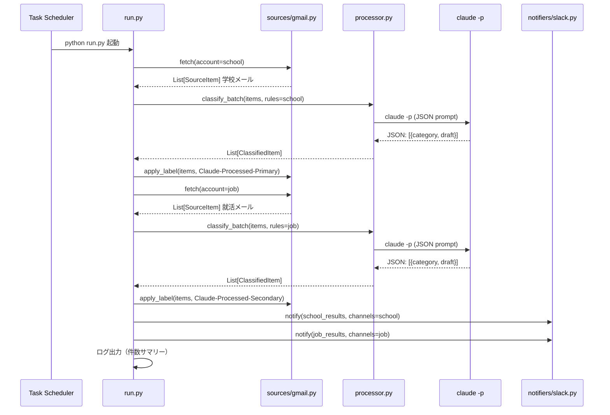
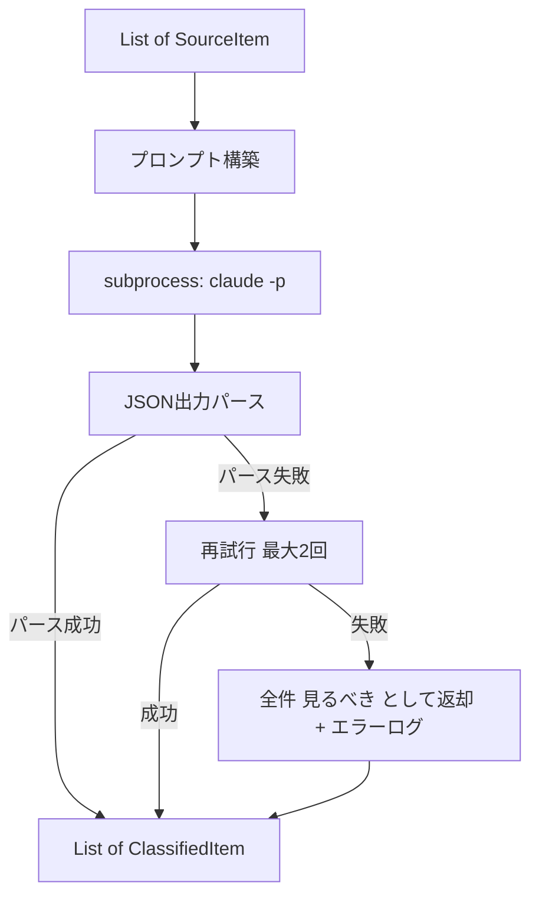

# Design Document: email-triage-automation

## Overview

本フィーチャーは、モジュラー構造のPythonフレームワークとClaude Code CLI（`claude -p`）を組み合わせ、複数の情報ソース（Gmail・将来的には論文DB等）を監視してSlackに通知する自動化基盤を実装する。AIによるメール分類・返信下書き生成はすべて`claude -p`サブプロセスに委譲し、Gmail APIとSlack Incoming Webhookで外部連携する。

**Purpose**: Primary・Secondary Gmailの受信メールを自動分類・通知し、重要メールへの対応漏れを防止する。同時に、論文監視等の将来的な情報ソース追加に対応できるフレームワーク基盤を提供する。
**Users**: 大学在学中・就職活動中の学生が、複数メールアカウントの管理効率を向上させるために利用する。
**Impact**: 手動メール確認をなくし、6時間ごとのSlack通知で対応優先度を自動整理する。

### Goals
- Primary・Secondary Gmailの自動取得・分類・Slack通知を実現する
- 新しい情報ソース（arXiv等）を追加する際に既存コードを変更不要にする
- Claude Codeサブスクリプション以外の追加費用ゼロを維持する
- Windowsタスクスケジューラで6時間ごとに無人実行できる

### Non-Goals
- 返信メールの自動送信
- 機密性の高い業務メールアカウントメールの処理
- Webダッシュボード・モバイル対応
- カレンダー連携（別スペック）

## Boundary Commitments

### This Spec Owns
- `sources/gmail.py`：Gmail APIによるメール取得・ラベル付与
- `processor.py`：`claude -p`サブプロセスによるAI分類・下書き生成
- `notifiers/slack.py`：Slack Incoming Webhookによる通知フォーマット・送信
- `run.py`：パイプライン全体のオーケストレーション
- `config.py`：アカウント設定・分類ルール・チャンネルマッピング
- `sources/base.py` / `notifiers/base.py`：将来の拡張のための抽象基底クラス定義

### Out of Boundary
- Gmail OAuth初回認証フロー（セットアップ手順として別途提供）
- Slackチャンネルの作成・Webhook URL発行（事前手動作業）
- Windowsタスクスケジューラへの登録（セットアップ手順として別途提供）
- 論文監視ソース（`sources/arxiv.py`等）の実装（別スペック）

### Allowed Dependencies
- Python 3.10+（Windows標準またはインストール済み）
- `google-api-python-client`, `google-auth-oauthlib`（Gmail API）
- `requests`（Slack Webhook送信）
- Claude Code CLI（`claude`コマンドがPATHに存在すること）

### Revalidation Triggers
- `BaseSource` / `BaseNotifier` インターフェース変更（全実装クラスに影響）
- `claude -p` の出力フォーマット変更（`processor.py`のパースロジックに影響）
- Gmail API v1 の廃止・破壊的変更
- Slack Incoming Webhook仕様変更

## Architecture

### Architecture Pattern & Boundary Map

**選択パターン**: Pipeline + Modular Sources/Notifiers

`run.py`が各Sourceからアイテムを収集し、`processor.py`（`claude -p`）でAI処理し、`notifiers/slack.py`で通知する。SourceとNotifierは抽象基底クラスを持ち、将来の拡張で既存コードを変更不要にする。

```mermaid
graph TB
    Scheduler[Windows Task Scheduler] -->|6時間ごと| RunPy[run.py]
    RunPy --> GmailSource[sources/gmail.py]
    RunPy --> Processor[processor.py]
    RunPy --> SlackNotifier[notifiers/slack.py]

    GmailSource -->|Gmail API| GmailSchool[Gmail (Primary)]
    GmailSource -->|Gmail API| GmailJob[Gmail (Secondary)]

    Processor -->|subprocess claude -p| ClaudeCLI[Claude Code CLI]
    ClaudeCLI -->|JSON出力| Processor

    SlackNotifier -->|Incoming Webhook| Ch1[学校-要対応]
    SlackNotifier -->|Incoming Webhook| Ch2[学校-ダイジェスト]
    SlackNotifier -->|Incoming Webhook| Ch3[就活-要対応]
    SlackNotifier -->|Incoming Webhook| Ch4[就活-ダイジェスト]

    GmailSource -->|ラベル付与| GmailSchool
    GmailSource -->|ラベル付与| GmailJob

    RunPy -->|追記| LogFile[logs/run.log]
```

### Technology Stack

| Layer | Choice | Role | Notes |
|-------|--------|------|-------|
| Orchestration | Python 3.10+ `run.py` | パイプライン制御・ログ出力 | 標準ライブラリのみで動作 |
| AI Processing | Claude Code CLI `claude -p` | メール分類・下書き生成 | JSON出力モードで安定パース |
| Email Source | `google-api-python-client` v2 | Gmail API v1 呼び出し | OAuth2認証、refresh_token永続化 |
| Notification | `requests` + Slack Incoming Webhook | Slack送信 | チャンネルごとにWebhook URL |
| State | Gmailラベル | 処理済みメール追跡 | 外部DB不要 |
| Scheduler | Windows Task Scheduler | 6時間ごとの定期実行 | OS標準機能 |
| Config | `config.py` + `.env` | アカウント設定・秘匿情報管理 | python-dotenvで.envロード |

## File Structure Plan

```
email-triage-automation/
├── run.py                    # オーケストレーション・エントリポイント
├── config.py                 # アカウント設定・分類ルール・チャンネルマッピング
├── processor.py              # claude -p サブプロセスラッパー・出力パーサ
├── sources/
│   ├── __init__.py
│   ├── base.py               # BaseSource 抽象基底クラス
│   └── gmail.py              # Gmail ソース実装（2アカウント対応）
├── notifiers/
│   ├── __init__.py
│   ├── base.py               # BaseNotifier 抽象基底クラス
│   └── slack.py              # Slack Webhook 通知実装
├── requirements.txt          # 依存パッケージ一覧
├── .env                      # 秘匿情報（Webhook URL、クレデンシャルパス）※gitignore
├── .env.example              # .envのサンプル（コミット可）
├── .gitignore                # credentials/, tokens/, .env を除外
├── credentials/              # Gmail OAuthクレデンシャルJSON（gitignore）
│   └── .gitkeep
├── tokens/                   # Gmail OAuthトークンJSON（gitignore）
│   └── .gitkeep
└── logs/
    └── .gitkeep              # 実行ログ格納ディレクトリ
```

## System Flows

### メインパイプライン（6時間ごと）



### claude -p バッチ処理フロー



## Requirements Traceability

| Requirement | Summary | Components |
|-------------|---------|------------|
| 1.1 | 定期実行時にGmail取得 | `run.py`, `sources/gmail.py` |
| 1.2 | 前回処理以降のみ取得 | `sources/gmail.py`（ラベルフィルタ） |
| 1.3 | 前回記録なし時は24時間 | `sources/gmail.py`（初回判定） |
| 1.4 | 処理済みラベル付与 | `sources/gmail.py`（label_message） |
| 1.5 | アカウント識別 | `config.py`（AccountConfig） |
| 2.1〜2.7 | アカウント別3分類 | `processor.py`（claude -p）, `config.py`（分類ルール） |
| 3.1〜3.3 | 返信下書き生成・非送信 | `processor.py`（claude -pプロンプト） |
| 4.1〜4.9 | アカウント別Slack通知 | `notifiers/slack.py`, `config.py`（チャンネルマッピング） |
| 5.1〜5.2 | 重複処理防止・エラー時再試行 | `sources/gmail.py`（ラベル除外）, `run.py`（エラー処理） |
| 6.1 | 6時間ごと実行 | Windows Task Scheduler + `run.py` |
| 6.2〜6.3 | Gmail/Slack失敗時処理 | `run.py`（try/except + ログ） |
| 6.4 | 実行ログ記録 | `run.py`（logging module → logs/run.log） |

## Components and Interfaces

### Component Summary

| Component | Layer | Intent | Req Coverage | Key Dependencies |
|-----------|-------|--------|--------------|-----------------|
| `run.py` | Orchestration | パイプライン制御・エラーハンドリング・ログ | 1.1, 5〜6全て | gmail.py (P0), processor.py (P0), slack.py (P0) |
| `config.py` | Configuration | アカウント設定・分類ルール定義 | 1.5, 2全て, 4全て | なし |
| `processor.py` | AI Processing | claude -p呼び出し・JSON出力パース | 2全て, 3全て | Claude Code CLI (P0) |
| `sources/base.py` | Abstraction | BaseSource 定義 | 拡張性 | なし |
| `sources/gmail.py` | Source | Gmail API取得・ラベル管理 | 1全て, 5.1〜5.2 | google-api-python-client (P0) |
| `notifiers/base.py` | Abstraction | BaseNotifier 定義 | 拡張性 | なし |
| `notifiers/slack.py` | Notifier | Slack Webhook送信・フォーマット | 4全て | requests (P0) |

---

### Orchestration Layer

#### `run.py`

| Field | Detail |
|-------|--------|
| Intent | 全コンポーネントを順序制御し、エラー時の継続動作とログ出力を担う |
| Requirements | 1.1, 5.1, 5.2, 6.1〜6.4 |

**Responsibilities & Constraints**
- `config.py` からアカウント設定を読み込み、各アカウントを順番に処理する
- 片方のアカウントでエラーが発生しても他方の処理を継続する（Graceful Degradation）
- 処理結果（件数・エラー）を `logs/run.log` に追記する
- `python run.py` が唯一の実行エントリポイント

**Contracts**: Batch [x]

##### Batch / Job Contract
- **Trigger**: `python run.py`（Windowsタスクスケジューラから呼び出し）
- **Input**: なし（`config.py` と `.env` から全設定を読み込む）
- **Output**: `logs/run.log`（追記）、Slack通知、Gmailラベル付与
- **Idempotency**: Gmailラベルにより冪等。重複実行しても処理済みメールは除外される

**Implementation Notes**
- Integration: `logging` モジュールで `FileHandler` と `StreamHandler` を両方設定。stdout はタスクスケジューラのログ、ファイルは `logs/run.log` へ
- Validation: 実行開始時に `claude --version` で Claude Code CLI の存在確認を行う
- Risks: `claude -p` の実行に数十秒かかる可能性。タスクスケジューラのタイムアウト設定に注意

---

### Configuration Layer

#### `config.py`

| Field | Detail |
|-------|--------|
| Intent | アカウント設定・分類ルール・Slackチャンネルマッピングを一元管理する |
| Requirements | 1.5, 2.1〜2.7, 4.1〜4.9 |

**Service Interface**

```python
from dataclasses import dataclass

@dataclass
class ClassificationRules:
    reply_needed: list[str]   # 返信必要の判定ヒント
    should_read: list[str]    # 見るべきの判定ヒント
    skip: list[str]           # スキップの判定ヒント

@dataclass
class AccountConfig:
    name: str                  # "Primary" | "Secondary"
    credential_file: str       # credentials/ 以下のJSONパス
    token_file: str            # tokens/ 以下のJSONパス
    processed_label: str       # "Claude-Processed-Primary" | "Claude-Processed-Secondary"
    reply_channel_webhook: str # #要対応チャンネルのWebhook URL（.envから）
    digest_channel_webhook: str# #ダイジェストチャンネルのWebhook URL（.envから）
    rules: ClassificationRules

# 設定インスタンス（run.pyがインポート）
ACCOUNTS: list[AccountConfig] = [
    AccountConfig(
        name="Primary",
        credential_file="credentials/primary_credentials.json",
        token_file="tokens/primary_token.json",
        processed_label="Claude-Processed-Primary",
        reply_channel_webhook=os.getenv("SLACK_PRIMARY_REPLY_WEBHOOK"),
        digest_channel_webhook=os.getenv("SLACK_PRIMARY_DIGEST_WEBHOOK"),
        rules=ClassificationRules(
            reply_needed=["教授", "事務局", "TA", "個別", "返信", "ご確認"],
            should_read=["授業", "試験", "学校行事", "お知らせ", "履修"],
            skip=["一斉配信", "広報", "メールマガジン", "自動送信"],
        ),
    ),
    AccountConfig(
        name="Secondary",
        ...
        rules=ClassificationRules(
            reply_needed=["人事", "リクルーター", "選考", "面接", "ご連絡"],
            should_read=["説明会", "選考日程", "合否", "不合格", "お祈り", "内定"],
            skip=["メルマガ", "自動返信", "キャンペーン", "登録"],
        ),
    ),
]
```

---

### AI Processing Layer

#### `processor.py`

| Field | Detail |
|-------|--------|
| Intent | `claude -p` をサブプロセスとして呼び出し、メールのバッチ分類と返信下書き生成を行う |
| Requirements | 2.1〜2.7, 3.1〜3.3 |

**Responsibilities & Constraints**
- 複数メールを1回の `claude -p` 呼び出しでバッチ処理してオーバーヘッドを最小化する
- 出力を厳密なJSON形式で要求し、パース失敗時はリトライする（最大2回）
- 返信下書きは「提案」として生成するのみで送信指示は含めない
- 返信下書き生成は「返信必要」分類のメールのみに限定する

**Service Interface**

```python
from dataclasses import dataclass
from typing import Literal

Category = Literal["返信必要", "見るべき", "スキップ"]

@dataclass
class SourceItem:
    id: str
    from_address: str
    subject: str
    received_at: str      # ISO 8601
    body_preview: str     # 最初の500文字
    account_name: str     # "Primary" | "Secondary"

@dataclass
class ClassifiedItem:
    source: SourceItem
    category: Category
    draft_reply: str | None   # category == "返信必要" のみ非None
    reasoning: str            # 分類理由（デバッグ用）

def classify_batch(
    items: list[SourceItem],
    rules: ClassificationRules,
) -> list[ClassifiedItem]:
    """claude -p でバッチ分類。失敗時は全件 見るべき として返す。"""
    ...
```

**claude -p プロンプト構造**

```
以下のメールを指定ルールに従って分類し、JSON形式で返してください。

## 分類ルール
- 返信必要: {rules.reply_needed}
- 見るべき: {rules.should_read}
- スキップ: {rules.skip}

## 制約
- 返信下書きは提案のみ。実際に送信しないこと
- 出力は必ず以下のJSON形式のみ（他のテキスト不可）

## 出力フォーマット
[{"id": "...", "category": "返信必要|見るべき|スキップ", "draft_reply": "...|null", "reasoning": "..."}]

## 対象メール
{json.dumps(items, ensure_ascii=False)}
```

**Implementation Notes**
- Integration: `subprocess.run(['claude', '-p', prompt_text], capture_output=True, text=True, timeout=120)`
- Validation: JSON出力の `id` が入力の `id` と一致するか確認。不一致はパースエラーとして扱う
- Risks: メール件数が多い場合（20件超）はプロンプトが長くなりコンテキスト超過の可能性。件数上限（デフォルト50件）を設定する

---

### Source Layer

#### `sources/base.py`

```python
from abc import ABC, abstractmethod
from processor import SourceItem

class BaseSource(ABC):
    @abstractmethod
    def fetch(self) -> list[SourceItem]:
        """未処理アイテムを取得して返す。"""
        ...

    @abstractmethod
    def mark_processed(self, items: list[SourceItem]) -> None:
        """アイテムを処理済みとしてマークする。"""
        ...
```

#### `sources/gmail.py`

| Field | Detail |
|-------|--------|
| Intent | Gmail APIで未処理メールを取得し、処理後にラベルを付与する |
| Requirements | 1.1〜1.5, 5.1〜5.2 |

**Service Interface**

```python
class GmailSource(BaseSource):
    def __init__(self, config: AccountConfig) -> None: ...

    def fetch(self) -> list[SourceItem]:
        """Claude-Processedラベルなしの過去24h（または前回実行以降）のメールを取得。"""
        ...

    def mark_processed(self, items: list[SourceItem]) -> None:
        """Gmail API label_message で処理済みラベルを付与。"""
        ...
```

**Gmail API呼び出しパターン**
- 検索クエリ: `label:INBOX -label:{processed_label} newer_than:1d`
- `search_threads` → スレッドIDリスト取得
- `get_thread` → 最新メッセージ本文取得（最初の500文字）
- `label_message` → 処理済みラベル付与

**Implementation Notes**
- Integration: `google-auth-oauthlib` で `token_file` からtokenをロード。有効期限切れは `google.auth.transport.requests.Request` で自動リフレッシュ
- Validation: `credential_file` と `token_file` の存在確認を起動時に実施。欠損時は警告ログを出してそのアカウントをスキップ
- Risks: Google Workspaceアカウント（Primary）のOAuthトークンが失効した場合は手動再認証が必要。`logs/run.log` のエラーを定期確認すること

---

### Notifier Layer

#### `notifiers/base.py`

```python
from abc import ABC, abstractmethod
from processor import ClassifiedItem

class BaseNotifier(ABC):
    @abstractmethod
    def notify(self, items: list[ClassifiedItem], account_name: str) -> None:
        """分類済みアイテムを通知する。"""
        ...
```

#### `notifiers/slack.py`

| Field | Detail |
|-------|--------|
| Intent | 分類済みアイテムをSlack Incoming Webhookで4チャンネルに送信する |
| Requirements | 4.1〜4.9 |

**Service Interface**

```python
class SlackNotifier(BaseNotifier):
    def __init__(self, config: AccountConfig) -> None: ...

    def notify(self, items: list[ClassifiedItem], account_name: str) -> None:
        """返信必要は個別送信、見るべき+スキップはダイジェスト送信。0件時は送信しない。"""
        ...

    def _post_webhook(self, webhook_url: str, text: str) -> None:
        """requests.post でWebhookに送信。失敗時はValueError。"""
        ...
```

**通知フォーマット**

返信必要（個別、`reply_channel_webhook` へ）:
```
🔴 【返信必要】
From: {from_address}
件名: {subject}
受信: {received_at}
━━━━━━━━━━
【返信下書き】
{draft_reply}
```

ダイジェスト（まとめ、`digest_channel_webhook` へ）:
```
🟡 【見るべきメール {N}件】
・{from} / {subject} — {reasoning}

⚪ 【スキップ {N}件】
・{subject}（{from}）

📊 返信必要: X件 / 見るべき: Y件 / スキップ: Z件
```

**Implementation Notes**
- Integration: `requests.post(webhook_url, json={"text": message}, timeout=10)`
- Validation: Webhook URLが `.env` に設定されているか起動時に確認。欠損時はそのチャンネルへの送信をスキップ
- Risks: Slack Webhook URLは秘匿情報として `.env` で管理し `.gitignore` に追加する

## Data Models

### Domain Model

```
AccountConfig {
  name: str
  processed_label: str
  reply_channel_webhook: str   # 秘匿
  digest_channel_webhook: str  # 秘匿
  rules: ClassificationRules
}

SourceItem {
  id: str                  # Gmail message ID
  from_address: str
  subject: str
  received_at: str         # ISO 8601
  body_preview: str        # 最初の500文字
  account_name: str
}

ClassifiedItem {
  source: SourceItem
  category: "返信必要" | "見るべき" | "スキップ"
  draft_reply: str | None
  reasoning: str
}

ExecutionResult {
  account_name: str
  classified: list[ClassifiedItem]
  errors: list[str]
}
```

**永続化データ（Gmail側）**:
- `Claude-Processed-Primary`: Primaryアカウントの処理済みメッセージに付与するGmailラベル
- `Claude-Processed-Secondary`: Secondaryアカウントの処理済みメッセージに付与するGmailラベル

**秘匿データ（`.env`）**:
```
SLACK_PRIMARY_REPLY_WEBHOOK=https://hooks.slack.com/...
SLACK_PRIMARY_DIGEST_WEBHOOK=https://hooks.slack.com/...
SLACK_SECONDARY_REPLY_WEBHOOK=https://hooks.slack.com/...
SLACK_SECONDARY_DIGEST_WEBHOOK=https://hooks.slack.com/...
```

## Error Handling

### Error Strategy

アカウント単位のGraceful Degradation。片方のアカウントで障害が発生しても他方の処理を継続する。すべてのエラーは `logs/run.log` に記録する。

### Error Categories and Responses

| Category | Scenario | Response |
|----------|----------|----------|
| Gmail認証エラー | OAuthトークン失効 | エラーログ記録 → そのアカウントをスキップ → 他アカウント継続 |
| Gmail API失敗 | ネットワーク障害・レート制限 | エラーログ記録 → そのアカウントをスキップ |
| claude -p失敗 | CLIコマンド未検出・タイムアウト | エラーログ記録 → 全件「見るべき」として通知 |
| JSON解析失敗 | 出力フォーマット崩れ | 最大2回リトライ → 失敗時は全件「見るべき」として通知 |
| Slack送信失敗 | Webhook URL無効・ネットワーク障害 | エラーログ記録 → 処理完了として継続 |
| 処理対象0件 | 新着メールなし | Slack通知なし → 完了ログのみ出力 |

### Monitoring

- **ログファイル**: `logs/run.log`（実行開始・終了時刻、アカウント別処理件数、エラー内容を追記）
- **ログ形式**: `[YYYY-MM-DD HH:MM:SS] LEVEL message`
- **ログローテーション**: 実装対象外（肥大化した場合は手動削除）

## Testing Strategy

### Unit Tests（手動検証）
1. `processor.py`: サンプルメールを渡し、JSON出力が正しくパースされるか確認
2. `processor.py`: Primary・Secondaryそれぞれの分類ルールが正しく適用されるか確認（教授メール→返信必要、お祈りメール→見るべき）
3. `notifiers/slack.py`: Webhook URLにテストメッセージが送信できるか確認

### Integration Tests（実環境検証）
1. Primary Gmailから未読メールが取得できるか（`sources/gmail.py`単体実行）
2. Secondary Gmailから未読メールが取得できるか
3. `Claude-Processed-*` ラベルが正しく付与されるか
4. 2回目実行時に処理済みメールがスキップされるか（重複防止確認）
5. 4つのSlackチャンネルに正しく通知が届くか

### E2E Tests（初回セットアップ後検証）
1. `python run.py` を手動実行して `logs/run.log` に正常ログが出力されるか
2. Windowsタスクスケジューラに登録後、6時間後に自動実行されてSlack通知が届くか
3. 片方のGmailアカウントの `token_file` を削除して実行し、エラーログが出て他方が処理されるか

## Security Considerations

- **秘匿情報の分離**: Slack Webhook URLは `.env` で管理し、`config.py` では `os.getenv()` で参照する。`.env` は `.gitignore` に追加する
- **OAuth認証情報**: `credentials/` と `tokens/` ディレクトリは `.gitignore` に追加する
- **インターン先メールの除外**: `ACCOUNTS` リストに `company.example.com` アカウントを含めない。`config.py` のコメントで明示する
- **返信送信の防止**: `processor.py` のプロンプトに「実際に送信しないこと」を明記する

## 拡張ガイド（将来の論文監視等の追加）

新しい情報ソースを追加する際は以下のみで完結する（既存ファイルの変更不要）：

1. `sources/arxiv.py`（または任意のソース名）を作成し `BaseSource` を継承する
2. `config.py` に新しいソース設定を追加する
3. `run.py` の `SOURCES` リストに新しいソースを追加する

```python
# run.py（追加箇所のみ）
from sources.arxiv import ArxivSource
SOURCES = [
    GmailSource(ACCOUNTS[0]),
    GmailSource(ACCOUNTS[1]),
    ArxivSource(ARXIV_CONFIG),   # ← これを追加するだけ
]
```
